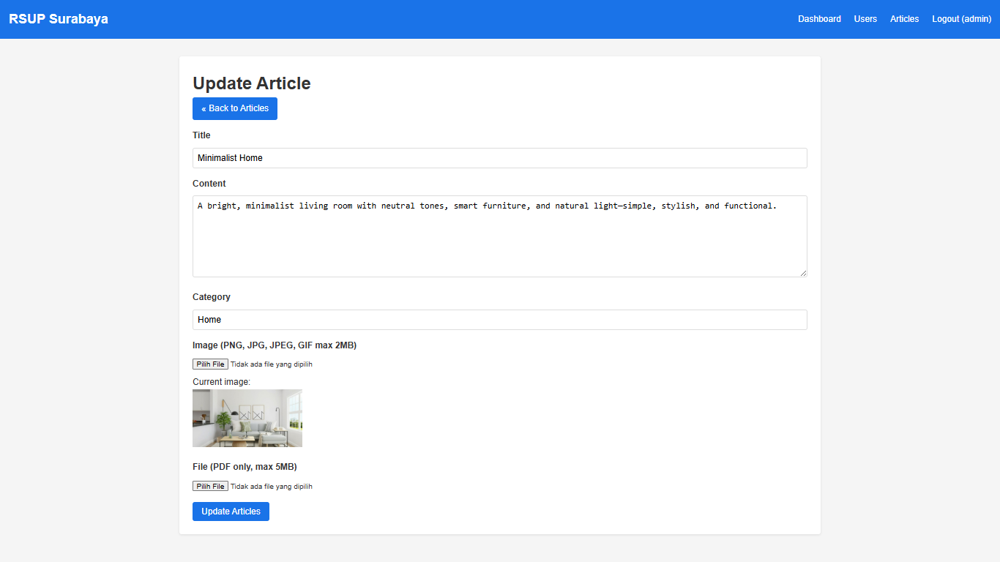

# RSUP Surabaya - Full Stack Web Application

This is a full-stack web application developed as part of the Technical Test for RSUP Surabaya. The application is built using the CodeIgniter 3 framework for the backend, with a custom front-end implementation using vanilla HTML, CSS, and JavaScript.

## Features

### Authentication and Authorization

- User login with session-based authentication
- Role-based access control with three roles:
  - Admin: Full management of articles and users (create, read, update, delete)
  - Editor: Full management of articles (create, read, update, delete) and read-only access to user information
  - User: Read-only access to articles
- Google reCAPTCHA integration for login form validation

### CRUD Operations

- Complete CRUD functionality for Articles
- Admin-only CRUD operations for Users
- Role-specific access to CRUD operations

### Validation

- Client-side validation using JavaScript
- Server-side validation using CodeIgniter's Form Validation library
- Input sanitization to prevent XSS and SQL injection

### Advanced Features

- Pagination for data listings
- Search and filtering capabilities
- AJAX-based for seamless user experience
- File upload functionality for PDF and image files
- REST API endpoints for mobile applications or third-party integrations

## Technology Stack

### Frontend

- HTML5 for structure
- Custom CSS for styling (no Bootstrap or other CSS frameworks)
- Vanilla JavaScript for client-side interactions and validations

### Backend

- CodeIgniter 3 PHP framework
- MySQL database
- RESTful API implementation
- Session-based authentication with token support for API

## Project Structure

```
project_root/
│
├── application/
│   ├── controllers/             # Controllers for web and API
│   │   ├── api/                 # API controllers
│   ├── models/                  # Database models
│   ├── views/                   # View templates
│   │   ├── articles/			 # Article views
│   │   ├── auth/                # Authentication views
│   │   ├── dashboard/           # Dashboard views
│   │   ├── errors/              # Error pages
│   │   ├── templates/           # Reusable templates
│   │   └── user/                # User views
│
└── uploads/               		 # Uploaded files storage
│   ├── files/                	 # PDF files
│   └── images/              	 # Image files
```

## Installation and Setup

1. Clone the repository:

   ```
   git clone https://github.com/zdnkarim/rsup_surabaya.git
   ```

2. Set up the database:

   - Create a MySQL database
   - Import the database schema from `schema.sql`
   - Configure database connection in `application/config/database.php`

3. Configure base URL:

   - Update the base URL in `application/config/config.php`

4. Start the application:
   - Navigate to the base URL in your browser
   - Log in with default admin credentials:
     - Username: admin
     - Password: password123
   - Log in with default editor credentials:
     - Username: editor
     - Password: password123
   - Log in with default user credentials:
     - Username: user
     - Password: password123

## User Interface Screenshots

### Login Page


### Admin Dashboard


### Articles List


### Article Detail



### User Management


### User Detail


